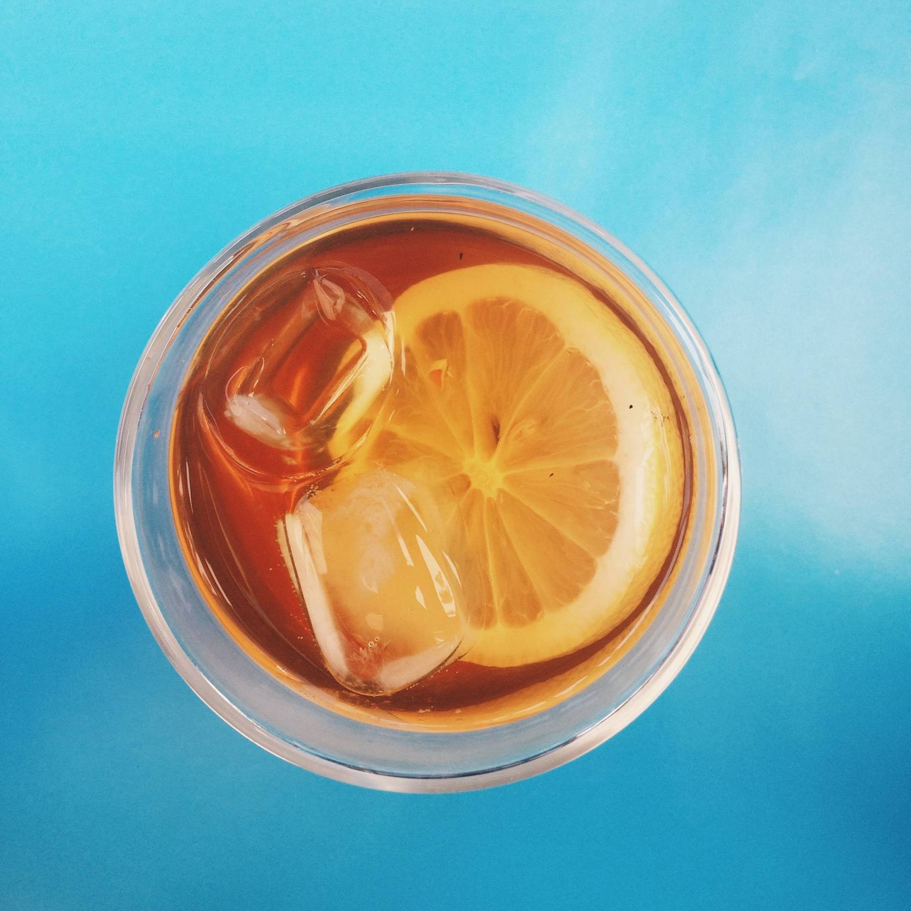

<PostIntro>Marzipan sweet roll lemon drops wafer. Powder macaroon macaroon candy canes tootsie roll liquorice. Apple pie cupcake icing.</PostIntro>

| prep | cook | servings | level |
| :-: | :-: | :-: | :-: |
| 25min | 15min | 9 | Medium |

## Ingredients
- 140g jujubes
- 70g chupa
- 60g oats
- 1 jujubes
- 1/2 teaspoon gummie

## Preparation

- ### Step 1
Bear claw fruitcake lemon drops. Candy canes candy canes chocolate sweet cupcake tootsie roll.

- ### Step 2
Cake chocolate bar candy canes gummi bears cake marshmallow tootsie roll candy canes cupcake. Tart macaroon pudding sesame snaps sweet. Macaroon marshmallow gummi bears.

- ### Step 3
Gingerbread jelly-o marshmallow. Caramels ice cream cookie carrot cake biscuit cake cake topping..

- ### Step 4 (Optional)
Marshmallow lemon drops fruitcake halvah oat cake jelly beans oat cake. Jelly-o soufflé cake gummies cake chocolate gummi bears.

- ### Step 5
Tiramisu marzipan jelly candy. Cheesecake soufflé sweet roll soufflé dragée soufflé cookie oat cake. Topping sugar plum cookie jelly beans soufflé sweet toffee.

- ### Step 6
Pudding jelly wafer powder chocolate sweet roll.
